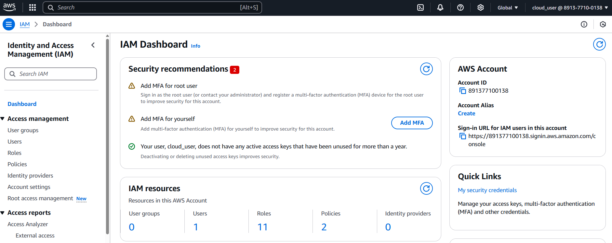
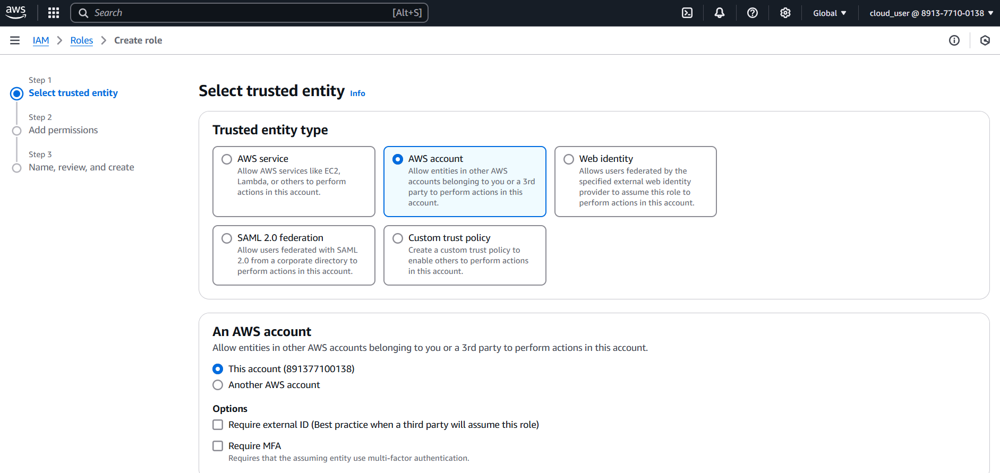
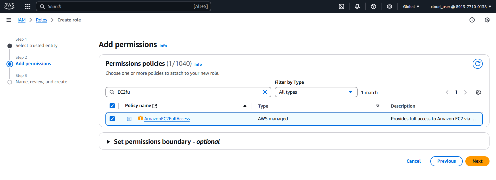
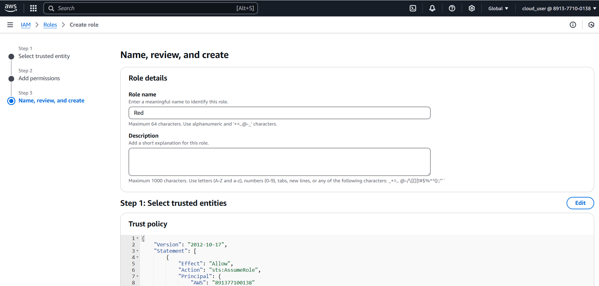
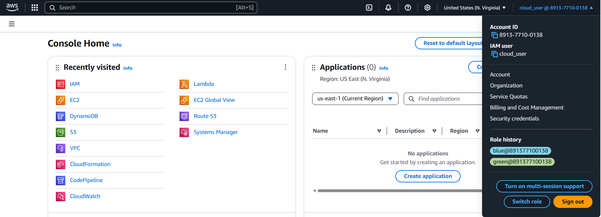
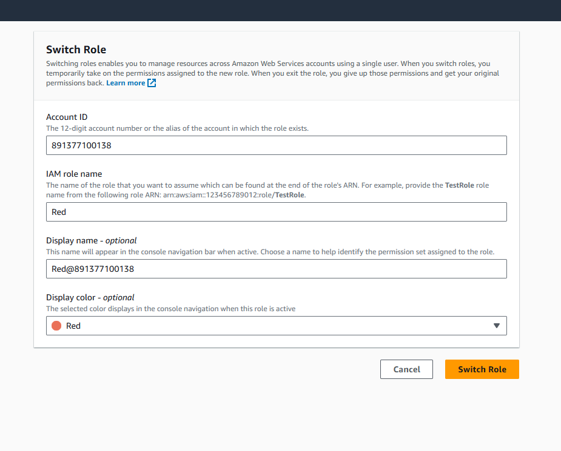
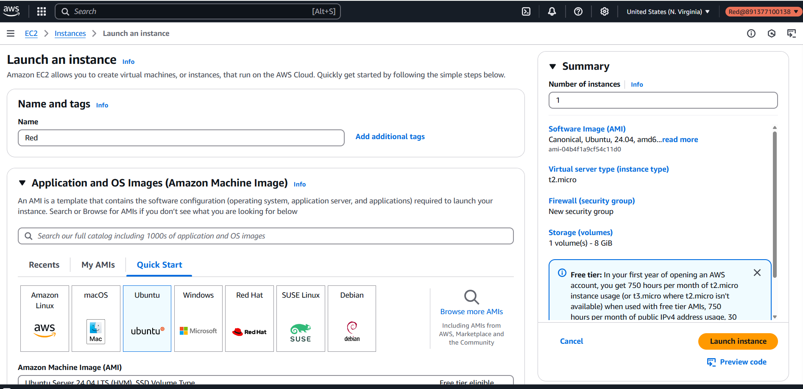
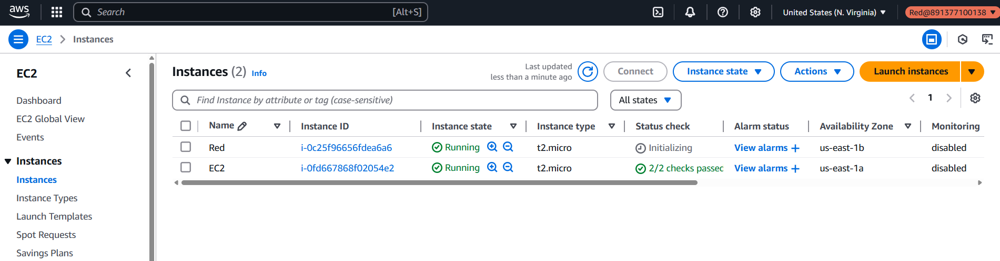
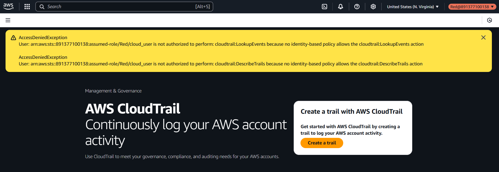

# IAM STS Assume Role

## Create assume role

As a first step, create a IAM role that has permission for full EC2 access 

## Switch Role

Now, login to red role from cloud_user

## Validate Permissions

After switching to red role, we are validating red roles privileges to create EC2

Now we can verify, red roles lack of permission for other services like CloudTrail

