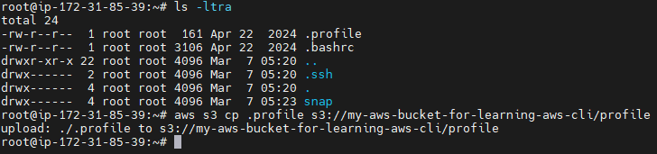

# IAM Instance Profile for EC2

## Create Instance Profile

## Attach SSM Permission for Connecting to EC2

## Attach Full S3 Permission for S3 Operations

## Review the Role

## Created Role

Note that the IAM role also has IAM instance profile

## EC2 with Instance Profile 

## Install AWS CLI in EC2

## Create a S3 Bucket from AWS Console

## Copy a file to S3 Bucket from EC2 without AWS Credentials

In this screenshot, you can see the file copied to a S3 bucket without any credentials configured.

This is possible because we have attached, S3 full permission IAM policy during the EC2 instance profile creation.

## Create a S3 Bucket from CLI

In this screenshot, you can see the bucket being created from EC2

