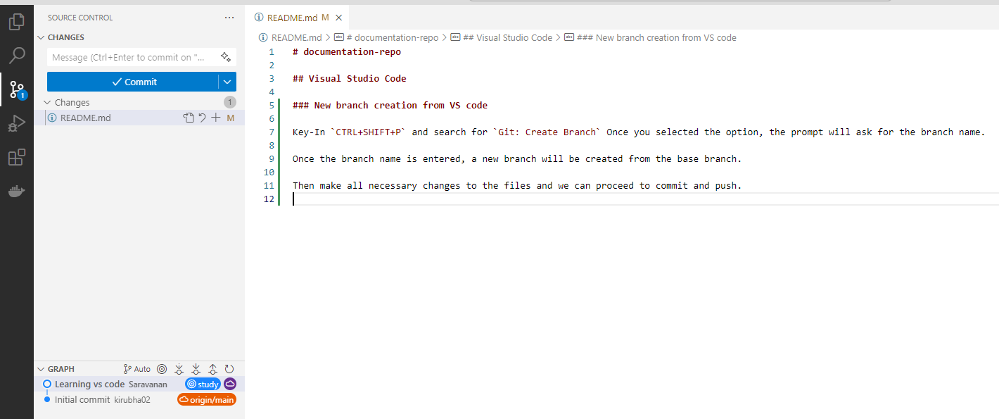
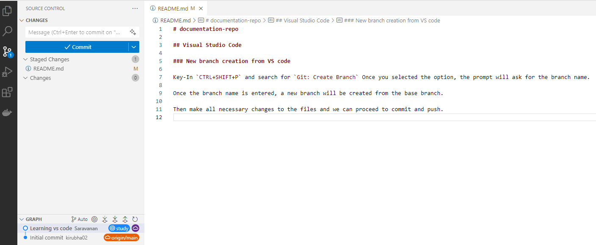
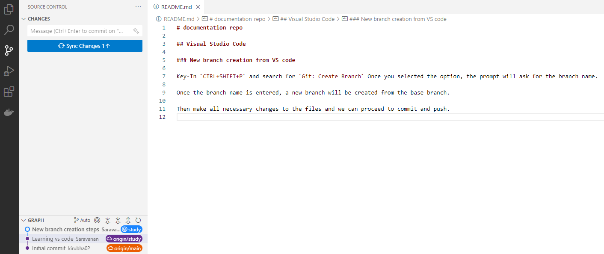
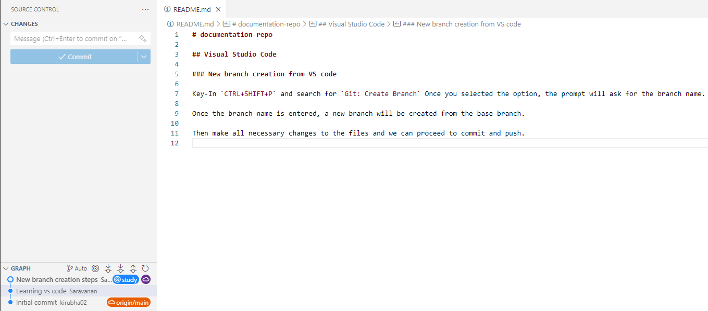

# documentation-repo

## Visual Studio Code

### Open VS code from git bash

- Open git bash terminal

- Navigate to appropriate directory using pwd, cd, ls commands

- Use the below command to open VS code for the directory

   `code .`

### New branch creation from VS code

Key-In `CTRL+SHIFT+P` and search for `Git: Create Branch` Once you selected the option, the prompt will ask for the branch name.

Once the branch name is entered, a new branch will be created from the base branch.

Then make all necessary changes to the files and we can proceed to commit and push.

### Make a change and push from VS code

#### Before staging

#### After staging

#### Before commit

#### After commit Before push

#### After push

